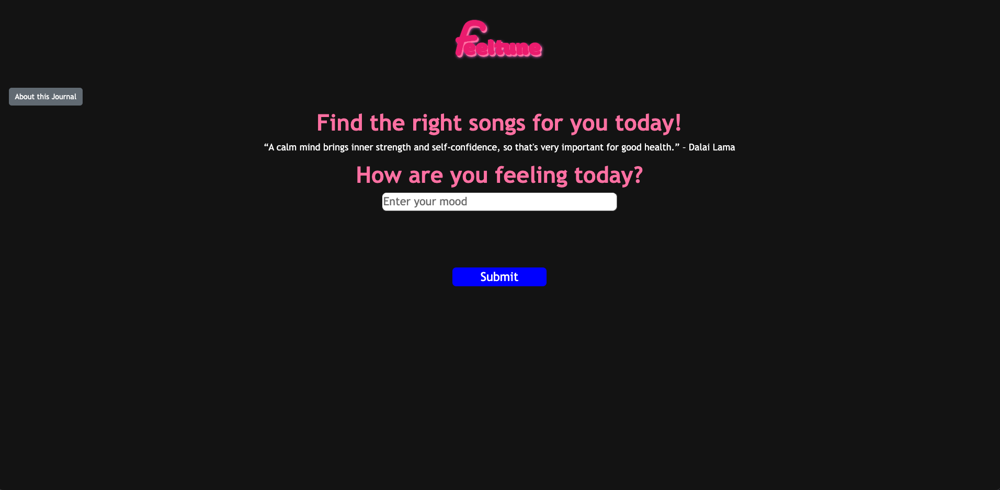
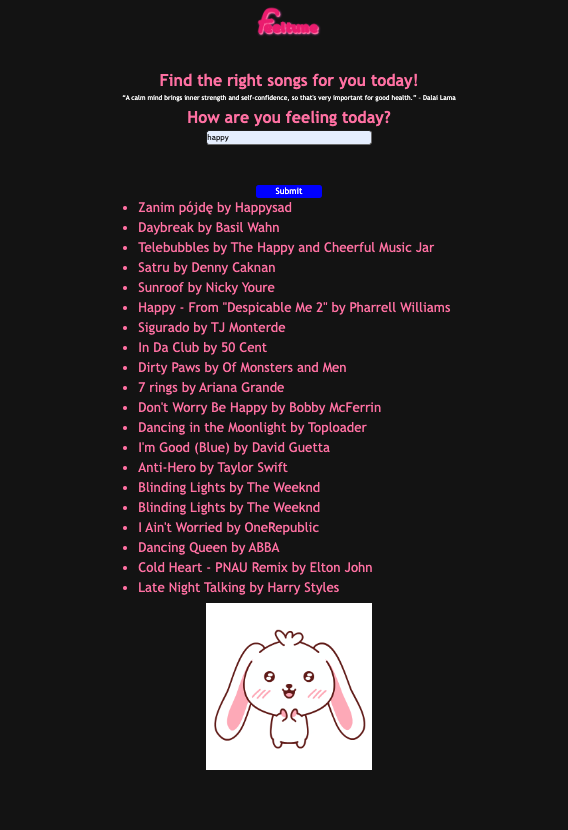

# feeltune-journal
 
 ### Preview of application (on-load)
 
 
 ### Preview of application (interacted)
 
 
 ### Deployed Application
 [Feeltune Journal](https://malyun39.github.io/feeltune-journal/)

## Description
Feeltune is an app that allow users to express themselves through music. This application is created and built to find an opportunity for the individuals to find the right song depending on how they’re feeling on that certain period of time; our product will solve the troubles of hours of finding appropriate songs that the user can add into their playlists or listen on the daily.

## Features
* Uses Spotify API to use data from user input to call back the API to generate a list of songs that match the value.
* Uses Giphy API to show a representation of the user's current mood through a GIF

## Technologies Used
* HTML
* CSS
* Javascript
* Bootstrap
* jQuery
* [Spotify API](https://developer.spotify.com/documentation/web-api/)
* [Giphy API](https://developers.giphy.com/)

## Usage

* Navigate to the webpage application
* Take a few seconds to read what the application is about by clicking on the `About this Journal` Modal on the top left-hand side of the application and hit `Close` when finished.
* To use the application, hit the text box with the placeholder text `Enter your mood` to input an 'emotion' you are feeling on the present day to enter in a 'mood'
* Hit `Submit`
* A list of songs underneath the submit button will generate, and these songs will be tracks that have the same/similar feel to the 'mood' you have inputted
* Underneath the list of songs, a GIF will appear to show a visual representation of the current mood.
* The journal will reset every day

## Collaborators

* [Josh Capito](https://github.com/jemcap)
* [Moses Anifowose](https://github.com/Princeultim8)

## Licence

This code uses MIT License.
